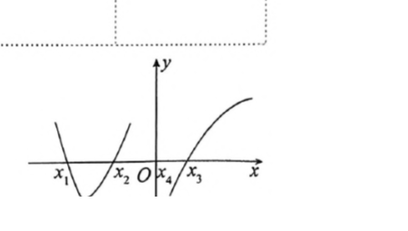

[TOC]

# 高等数学错题本

## 1. 函数极限连续

### 1.1 数列与函数极限

**1.1.1**

设有数列 $\{x_n\}$ 与 $\{y_n\}$，以下结论正确的是

（A）若 $\lim_{n\to\infty}x_ny_n=0$，则必有 $\lim_{n\to\infty}x_n=0$ 或 $\lim_{n\to\infty}y_n=0$。

（B）若 $\lim_{n\to\infty}x_ny_n=\infty$，则必有 $\lim_{n\to\infty}x_n=\infty$ 或 $\lim_{n\to\infty}y_n=\infty$。

（C）若 $x_ny_n$ 有界，则必有 $x_n$ 与 $y_n$ 都有界。

（D）若 $x_ny_n$ 无界，则必有 $x_n$ 无界或 $y_n$ 无界。

**答案**

（D）。

**解析**

用反证法：若 $x_n$ 和 $y_n$ 都有界，则乘积 $x_ny_n$ 必有界，与题设矛盾，故（D）正确。

其余选项可由反例排除。对（A）、（C），可取

$$
x_n:1,0,3,0,\ldots,\qquad y_n:0,2,0,4,\ldots;
$$

此时 $x_ny_n=0$，但 $x_n,y_n$ 均无界且均不趋于 $0$。对（B），可取

$$
x_n:1,1,3,1,\ldots,\qquad y_n:1,2,1,4,\ldots;
$$

此时 $x_ny_n\to\infty$，但 $x_n,y_n$ 均不趋于无穷。

> 来源：27武忠祥《高等数学辅导讲义.严选题》，第一章第 3 题，题目书内第 2 页 / PDF 第 7 页；解析书内第 142 页 / PDF 第 147 页。

**1.1.2**

设 $\lim_{x\to0}\varphi(x)=0$，则下列命题中正确的个数为

（1）$\lim_{x\to0}\frac{\sin\varphi(x)}{\varphi(x)}=1$。

（2）$\lim_{x\to0}(1+\varphi(x))^{\frac{1}{\varphi(x)}}=e$。

（3）若 $f'(x_0)=A$，则 $\lim_{x\to0}\frac{f(x_0+\varphi(x))-f(x_0)}{\varphi(x)}=A$。

（4）若 $\lim_{u\to0}f(u)=A$，则 $\lim_{x\to0}f(\varphi(x))=A$。

（A）0 个。 （B）2 个。 （C）3 个。 （D）4 个。

**答案**

（A），0 个。

**解析**

题目只给出 $\varphi(x)\to0$，没有保证在 $x=0$ 的去心邻域内 $\varphi(x)\ne0$。例如取 $\varphi(x)\equiv0$，前三个式子的分式或幂式没有定义，第（4）个复合极限也不能直接由 $u\to0$ 的去心极限推出。因此四个命题按原条件均不必成立。若补充 $\varphi(x)\ne0$，则四个命题均成立。

> 来源：27武忠祥《高等数学辅导讲义.严选题》，第一章第 7 题，题目书内第 3 页 / PDF 第 8 页；解析书内第 142 页 / PDF 第 147 页。

### 1.2 函数的连续性与间断点

**1.2.1**

设

$$
f(x)=\lim_{n\to\infty}\frac{2e^{(n+1)x}+1}{e^{nx}+x^n+1},
$$

则 $f(x)$

（A）仅有一个可去间断点。 （B）仅有一个跳跃间断点。

（C）有两个可去间断点。 （D）有两个跳跃间断点。

**答案**

（D）。

**解析**

利用 $e^{nx}$ 与 $x^n$ 随 $n\to\infty$ 的变化，得到

$$
f(x)=
\begin{cases}
0, & x<-1,\\
1, & -1<x<0,\\
2e^x, & x>0.
\end{cases}
$$

在 $x=-1$ 处，左右极限分别为 $0$ 和 $1$；在 $x=0$ 处，左右极限分别为 $1$ 和 $2$。两点的左右极限都存在但不相等，故 $x=-1$ 与 $x=0$ 均为跳跃间断点。

> 来源：27武忠祥《高等数学辅导讲义.严选题》，第一章第 18 题，题目书内第 6 页 / PDF 第 11 页；解析书内第 144-145 页 / PDF 第 149-150 页。

### 1.3 连续函数的零点定理与介值定理

**1.3.1**

设 $f(x)$ 在 $[0,2a]$（$a>0$）上连续，且 $f(0)=f(2a)$，求证存在 $\xi\in[0,a]$，使 $f(\xi)=f(\xi+a)$。

**答案**

存在满足条件的 $\xi\in[0,a]$。

**解析**

令

$$
F(x)=f(x)-f(x+a),\qquad x\in[0,a].
$$

则

$$
F(0)=f(0)-f(a),\qquad F(a)=f(a)-f(2a)=f(a)-f(0).
$$

若 $F(0)=0$，取 $\xi=0$ 即可；若 $F(0)\ne0$，则 $F(0)$ 与 $F(a)$ 异号。由连续函数零点定理，存在 $\xi\in(0,a)$ 使 $F(\xi)=0$，即 $f(\xi)=f(\xi+a)$。

> 来源：27武忠祥《高等数学辅导讲义.严选题》，第一章第 48 题，题目书内第 14 页 / PDF 第 19 页；解析书内第 153 页 / PDF 第 158 页。

**1.3.2**

设 $f(x)$ 在 $[a,b]$ 上连续，$x_i\in[a,b]$，$t_i>0$（$i=1,2,\ldots,n$），且 $\sum_{i=1}^n t_i=1$，试证至少存在一点 $\xi\in[a,b]$，使

$$
f(\xi)=t_1f(x_1)+t_2f(x_2)+\cdots+t_nf(x_n).
$$

**答案**

至少存在一点 $\xi\in[a,b]$ 满足所给等式。

**解析**

设 $f(x)$ 在 $[a,b]$ 上的最大值为 $M$，最小值为 $m$。因为 $t_i>0$ 且 $\sum_{i=1}^n t_i=1$，所以

$$
m\le t_1f(x_1)+t_2f(x_2)+\cdots+t_nf(x_n)\le M.
$$

该加权平均值位于 $f$ 的值域 $[m,M]$ 内。由连续函数介值定理，至少存在一点 $\xi\in[a,b]$ 使题设等式成立。

> 来源：27武忠祥《高等数学辅导讲义.严选题》，第一章第 49 题，题目书内第 14 页 / PDF 第 19 页；解析书内第 153 页 / PDF 第 158 页。

## 2. 一元函数微分学

### 2.1 导数的定义与可导性

**2.1.1**

设 $f(x)$ 在 $x=0$ 处连续，则 $f(x)$ 在 $x=0$ 处可导的充分条件是

（A）$\lim_{x\to0}\frac{f(x)-f(-x)}{2x}$ 存在。

（B）$\lim_{x\to0}\frac{f(\ln(1+x^2))-f(0)}{x^2}$ 存在。

（C）$\lim_{x\to0}\frac{f(x)-f(0)}{\sqrt[3]{x}}$ 存在。

（D）$\lim_{x\to\infty}xf\left(\frac1x\right)$ 存在。

**答案**

（D）。

**解析**

由（D）知

$$
\lim_{x\to\infty}xf\left(\frac1x\right)
=\lim_{x\to\infty}\frac{f(1/x)}{1/x}
$$

存在。又 $1/x\to0$，结合 $f$ 在 $0$ 处连续可得 $f(0)=0$。令 $t=1/x$，则

$$
\lim_{t\to0}\frac{f(t)-f(0)}{t}
$$

存在，故 $f'(0)$ 存在。其余条件只考察对称差商、单侧复合路径或比 $x$ 更低阶的分母，均不足以保证可导；例如 $f(x)=|x|$ 可分别排除（A）、（B）、（C）。

> 来源：27武忠祥《高等数学辅导讲义.严选题》，第二章第 1 题，题目书内第 18 页 / PDF 第 23 页；解析书内第 153 页 / PDF 第 158 页。

**2.1.2**

设 $f(x)$ 有连续一阶导数，$f(0)=0$。若当 $x\to0$ 时，$\int_0^{f(x)}f(t)\ dt$ 与 $4x^2$ 为等价无穷小，则 $f'(0)$ 等于

（A）0。 （B）1。 （C）2。 （D）$\frac12$。

**答案**

（C），$f'(0)=2$。

**解析**

由等价无穷小关系，

$$
\lim_{x\to0}\frac{\int_0^{f(x)}f(t)\ dt}{4x^2}=1.
$$

应用洛必达法则，并利用 $f(0)=0$ 与 $f$ 的一阶导数连续，可得

$$
1=\lim_{x\to0}\frac{f(f(x))f'(x)}{8x}=\frac{[f'(0)]^3}{8}.
$$

因此 $f'(0)=2$。

> 来源：27武忠祥《高等数学辅导讲义.严选题》，第二章第 6 题，题目书内第 19 页 / PDF 第 24 页；解析书内第 154 页 / PDF 第 159 页。

**2.1.3**

设

$$
f(x)=\lim_{n\to\infty}\sqrt[n]{1+|x|^n+e^{nx}},
$$

则不可导点的个数为

（A）0。 （B）1。 （C）2。 （D）3。

**答案**

（C），2 个。

**解析**

由有限项非负数的 $n$ 次方和开 $n$ 次方的极限等于各底数的最大值，

$$
f(x)=\max\{1,|x|,e^x\}=
\begin{cases}
-x, & x<-1,\\
1, & -1\le x\le0,\\
e^x, & x>0.
\end{cases}
$$

在 $x=-1$ 和 $x=0$ 处左右导数不相等，故共有 2 个不可导点。

> 来源：27武忠祥《高等数学辅导讲义.严选题》，第二章第 8 题，题目书内第 20 页 / PDF 第 25 页；解析书内第 154 页 / PDF 第 159 页。

**2.1.4**

已知 $f(x)$ 在 $x=0$ 处连续，且

$$
\lim_{x\to0}\frac{x^2}{f(x)}=1,
$$

则下列结论中：

① $f'(0)$ 存在，且 $f'(0)=0$；

② $f''(0)$ 存在，且 $f''(0)=2$；

③ $f(x)$ 在 $x=0$ 处取得极小值；

④ $f''(x)$ 在 $x=0$ 的某邻域内连续。

正确的个数为（A）1。 （B）2。 （C）3。 （D）4。

**答案**

（B），2 个；①、③正确。

**解析**

由 $x^2/f(x)\to1$ 与连续性得 $f(0)=0$，并且

$$
f'(0)=\lim_{x\to0}\frac{f(x)-f(0)}{x}
=\lim_{x\to0}\frac{f(x)}{x^2}x=0,
$$

故①正确。又因 $f(x)\sim x^2>0$，在 $0$ 的某个去心邻域内 $f(x)>0=f(0)$，故③正确。

②不必成立。例如

$$
f(x)=
\begin{cases}
x^2+x^3\sin\frac1x, & x\ne0,\\
0, & x=0,
\end{cases}
$$

满足题设，但 $f''(0)$ 不存在。④也不必成立，例如令 $f(x)=x^2$（$x$ 为有理数），$f(x)=x^2+x^3$（$x$ 为无理数），则题设成立，但函数只在 $x=0$ 处连续。

> 来源：27武忠祥《高等数学辅导讲义.严选题》，第二章第 9 题，题目书内第 20 页 / PDF 第 25 页；解析书内第 154-155 页 / PDF 第 159-160 页。

### 2.2 函数的极值与驻点

**2.2.1**

设函数 $f(x)$ 在 $(-\infty,+\infty)$ 内连续，其导函数的图形如图 1 所示，则 $f(x)$ 有

（A）一个极小值点和两个极大值点。

（B）两个极小值点和一个极大值点。

（C）两个极小值点和两个极大值点。

（D）三个极小值点和一个极大值点。

**答案**

（C）。

**解析**

根据导数在各临界点两侧的符号变化，$f(x)$ 在 $x=x_1$ 和 $x=x_4$ 处由增变减，取得极大值；在 $x=x_2$ 和 $x=x_3$ 处由减变增，取得极小值。因此有两个极小值点和两个极大值点。

> 来源：27武忠祥《高等数学辅导讲义.严选题》，第二章第 10 题（图 1），题目书内第 20 页 / PDF 第 25 页；解析书内第 155 页 / PDF 第 160 页。

**2.2.2**

设函数 $f(x)=|x^2(x+1)|$ 的驻点个数为 $m$，极值点的个数为 $n$，则

（A）$m=1,n=1$。 （B）$m=1,n=2$。 （C）$m=2,n=3$。 （D）$m=3,n=2$。

**答案**

（C），$m=2,n=3$。

**解析**

分段写为

$$
f(x)=
\begin{cases}
-x^2(1+x), & x\le-1,\\
x^2(1+x), & x>-1.
\end{cases}
$$

由 $f'(x)=0$ 得 $x=-\frac23$ 与 $x=0$，二者均为极值点，所以驻点有 2 个。$f'(-1)$ 不存在，但 $x=-1$ 也是极值点。因此极值点共有 3 个。

> 来源：27武忠祥《高等数学辅导讲义.严选题》，第二章第 11 题，题目书内第 21 页 / PDF 第 26 页；解析书内第 155 页 / PDF 第 160 页。

### 2.3 反函数的导数与高阶导数

**2.3.1**

设 $y=f(x)$ 的反函数是 $x=\varphi(y)$，且

$$
f(x)=\int_1^{2x}e^{t^2}\ dt+1,
$$

则 $\varphi''(1)=$ ________。

**答案**

$-\frac1{e^2}$。

**解析**

当 $x=\frac12$ 时 $f(x)=1$。又

$$
f'(x)=2e^{4x^2},\qquad f''(x)=16xe^{4x^2}.
$$

反函数满足

$$
\varphi'(y)=\frac1{f'(x)},\qquad
\varphi''(y)=-\frac{f''(x)}{[f'(x)]^3}.
$$

因此

$$
\varphi''(1)=-\frac{f''(1/2)}{[f'(1/2)]^3}
=-\frac{8e}{8e^3}=-\frac1{e^2}.
$$

> 来源：27武忠祥《高等数学辅导讲义.严选题》，第二章第 23 题，题目书内第 23 页 / PDF 第 28 页；解析书内第 157 页 / PDF 第 162 页。

**2.3.2**

函数

$$
f(x)=\ln|(x-1)(x-2)\cdots(x-n)|
$$

的驻点个数为 ________。

**答案**

$n-1$。

**解析**

令 $g(x)=(x-1)(x-2)\cdots(x-n)$，则在定义域内

$$
f'(x)=\frac{g'(x)}{g(x)}.
$$

因为 $g(1)=g(2)=\cdots=g(n)=0$，由罗尔定理，$g'(x)$ 在每个区间 $(k,k+1)$ 内至少有一个零点，共至少 $n-1$ 个。另一方面，$g'(x)$ 是 $n-1$ 次多项式，至多有 $n-1$ 个零点，故恰有 $n-1$ 个零点，且均不与 $g(x)$ 的零点重合。因此 $f(x)$ 有 $n-1$ 个驻点。

> 来源：27武忠祥《高等数学辅导讲义.严选题》，第二章第 26 题，题目书内第 24 页 / PDF 第 29 页；解析书内第 157 页 / PDF 第 162 页。

### 2.4 中值定理

**2.4.1**

设 $f(x)$ 和 $g(x)$ 在 $[0,1]$ 上连续，在 $(0,1)$ 内可导，$f(0)=f(1)=-1$，且

$$
\int_0^1f(x)\ dx>\frac12.
$$

证明至少存在一点 $\xi\in(0,1)$，使

$$
f'(\xi)+g'(\xi)[f(\xi)-\xi]=1.
$$

**答案**

至少存在一点 $\xi\in(0,1)$ 满足所给等式。

**解析**

令

$$
F(x)=e^{g(x)}[f(x)-x].
$$

由 $f(0)=f(1)=-1$，有 $F(0)<0,F(1)<0$。又

$$
\int_0^1[f(x)-x]\ dx
=\int_0^1f(x)\ dx-\frac12>0,
$$

故至少存在 $c\in(0,1)$ 使 $f(c)-c>0$，从而 $F(c)>0$。由零点定理，存在 $a\in(0,c)$、$b\in(c,1)$ 使 $F(a)=F(b)=0$。再由罗尔定理，存在 $\xi\in(a,b)$ 使 $F'(\xi)=0$。展开即得

$$
e^{g(\xi)}[f'(\xi)-1]+e^{g(\xi)}g'(\xi)[f(\xi)-\xi]=0,
$$

所以题设等式成立。

> 来源：27武忠祥《高等数学辅导讲义.严选题》，第二章第 45 题，题目书内第 28 页 / PDF 第 33 页；解析书内第 161 页 / PDF 第 166 页。

**2.4.2**

设 $f(x),g(x)$ 在 $[0,1]$ 上连续，在 $(0,1)$ 内可导，且

$$
\int_0^1f(x)\ dx=3\int_{2/3}^1f(x)\ dx.
$$

试证存在 $\xi,\eta\in(0,1)$，使得

$$
f'(\xi)=g'(\xi)[f(\eta)-f(\xi)].
$$

**答案**

存在满足条件的 $\xi,\eta\in(0,1)$。

**解析**

由积分等式得

$$
\int_0^{2/3}f(x)\ dx=2\int_{2/3}^1f(x)\ dx.
$$

由积分中值定理，存在 $c\in(0,2/3)$、$\eta\in(2/3,1)$，使

$$
\frac23f(c)=\frac23f(\eta),
$$

即 $f(c)=f(\eta)$。令

$$
F(x)=e^{g(x)}[f(x)-f(\eta)].
$$

则 $F(c)=F(\eta)=0$。由罗尔定理，存在 $\xi\in(c,\eta)$ 使 $F'(\xi)=0$，即

$$
f'(\xi)=g'(\xi)[f(\eta)-f(\xi)].
$$

> 来源：27武忠祥《高等数学辅导讲义.严选题》，第二章第 46 题，题目书内第 28 页 / PDF 第 33 页；解析书内第 161 页 / PDF 第 166 页。

### 2.5 泰勒公式

**2.5.1**

设 $f(x)$ 在 $[0,1]$ 上二阶可导，$f(0)=f(1)=0$，$\max_{0\le x\le1}f(x)=2$。试证存在 $\xi\in(0,1)$，使得 $f''(\xi)\le-16$。

**答案**

存在一点 $\xi\in(0,1)$，使 $f''(\xi)\le-16$。

**解析**

设 $f(c)=\max_{0\le x\le1}f(x)=2$，则 $0<c<1$ 且 $f'(c)=0$。分别在 $x=0$ 与 $x=1$ 处对 $f$ 在 $c$ 点使用带拉格朗日余项的泰勒公式，得到

$$
f''(\xi_1)=-\frac4{c^2},\quad \xi_1\in(0,c),
$$

以及

$$
f''(\xi_2)=-\frac4{(1-c)^2},\quad \xi_2\in(c,1).
$$

若 $c\le\frac12$，则 $f''(\xi_1)\le-16$；若 $c>\frac12$，则 $f''(\xi_2)\le-16$。故结论成立。

> 来源：27武忠祥《高等数学辅导讲义.严选题》，第二章第 53 题，题目书内第 30 页 / PDF 第 35 页；解析书内第 163 页 / PDF 第 168 页。

**2.5.2**

设 $f(x)$ 在 $[0,2]$ 上二阶可导，且 $|f(x)|\le1$，$|f''(x)|\le1$。证明

$$
|f'(x)|\le2,\qquad 0\le x\le2.
$$

**答案**

对任意 $x\in[0,2]$，均有 $|f'(x)|\le2$。

**解析**

固定 $x\in[0,2]$。分别在 $0$ 和 $2$ 处对 $f$ 在 $x$ 点使用带拉格朗日余项的泰勒公式：

$$
f(0)=f(x)-xf'(x)+\frac{f''(\xi_1)}2x^2,
$$

$$
f(2)=f(x)+(2-x)f'(x)+\frac{f''(\xi_2)}2(2-x)^2.
$$

第二式减第一式，整理并取绝对值得

$$
|f'(x)|
\le\frac{|f(0)|+|f(2)|}{2}
+\frac14\left[|f''(\xi_2)|(2-x)^2+|f''(\xi_1)|x^2\right].
$$

利用 $|f|\le1$、$|f''|\le1$ 以及 $(2-x)^2+x^2\le4$，得

$$
|f'(x)|\le1+\frac14\left[(2-x)^2+x^2\right]\le2.
$$

> 来源：27武忠祥《高等数学辅导讲义.严选题》，第二章第 54 题，题目书内第 30 页 / PDF 第 35 页；解析书内第 163 页 / PDF 第 168 页。

## 3. 一元函数积分学

### 3.2 定积分

**3.2.1**

设 $f(x)$ 在 $[0,1]$ 上连续，在 $(0,1)$ 内可导，且满足

$$
f(1)=k\int_0^{\frac1k}xe^{1-x}f(x)\ \mathrm{d}x\qquad(k>1).
$$

证明至少存在一点 $\xi\in(0,1)$，使得

$$
f'(\xi)=(1-\xi^{-1})f(\xi).
$$

**答案**

存在 $\xi\in(0,1)$ 满足 $f'(\xi)=(1-\xi^{-1})f(\xi)$。

**解析**

由积分中值定理，存在 $\xi_1\in[0,1/k]$，使

$$
f(1)=k\int_0^{\frac1k}xe^{1-x}f(x)\ \mathrm{d}x
=\xi_1e^{1-\xi_1}f(\xi_1).
$$

令 $\varphi(x)=xe^{1-x}f(x)$。则 $\varphi(\xi_1)=f(1)=\varphi(1)$。由罗尔定理，存在 $\xi\in(\xi_1,1)\subset(0,1)$，使 $\varphi'(\xi)=0$。于是

$$
e^{1-\xi}\bigl[f(\xi)-\xi f(\xi)+\xi f'(\xi)\bigr]=0,
$$

即 $f'(\xi)=(1-\xi^{-1})f(\xi)$。

> 来源：27武忠祥《高等数学辅导讲义.严选题》，第三章第 45 题，题目书内第 45 页 / PDF 第 50 页；解析书内第 169 页 / PDF 第 174 页。

**3.2.2**

设函数 $f(x)$ 在 $[0,1]$ 上有连续一阶导数，且 $f(0)=0$，试证至少存在一点 $\xi\in[0,1]$，使

$$
f'(\xi)=2\int_0^1f(x)\ \mathrm{d}x.
$$

**答案**

存在 $\xi\in[0,1]$ 满足 $f'(\xi)=2\int_0^1f(x)\ \mathrm{d}x$。

**解析**

由 $f(0)=0$，有 $f(x)=\int_0^x f'(t)\ \mathrm{d}t$。交换积分次序得

$$
\int_0^1f(x)\ \mathrm{d}x
=\int_0^1(1-t)f'(t)\ \mathrm{d}t.
$$

因 $f'$ 连续且 $1-t\geq0$，积分中值定理给出某个 $\xi\in[0,1]$，使

$$
\int_0^1(1-t)f'(t)\ \mathrm{d}t
=f'(\xi)\int_0^1(1-t)\ \mathrm{d}t
=\frac12f'(\xi).
$$

故 $f'(\xi)=2\int_0^1f(x)\ \mathrm{d}x$。

> 来源：27武忠祥《高等数学辅导讲义.严选题》，第三章第 50 题，题目书内第 47 页 / PDF 第 52 页；解析书内第 170 页 / PDF 第 175 页。

**3.2.3**

设函数 $f(x)$ 在 $[-l,l]$ 上连续，在 $x=0$ 处可导，且 $f'(0)\ne0$。

（1）证明：对任意 $x\in(0,l)$，至少存在 $\theta\in(0,1)$，使得

$$
=x[f(\theta x)-f(-\theta x)];
\int_0^x f(t)\ \mathrm{d}t+\int_0^{-x}f(t)\ \mathrm{d}t
=x[f(\theta x)-f(-\theta x)];
=x[f(\theta x)-f(-\theta x)];
$$

（2）求极限

$$
\lim_{x\to0^+}\theta.
$$

**答案**

（1）对每个 $x\in(0,l)$ 存在 $\theta\in(0,1)$ 满足等式；（2）$\displaystyle\lim_{x\to0^+}\theta=\frac12$。

**解析**

令

$$
F(u)=\int_0^u f(t)\ \mathrm{d}t+\int_0^{-u}f(t)\ \mathrm{d}t.
$$

则 $F(0)=0$，且 $F'(u)=f(u)-f(-u)$。对区间 $[0,x]$ 用拉格朗日中值定理，得某个 $\theta\in(0,1)$ 使

$$
F(x)=xF'(\theta x)=x[f(\theta x)-f(-\theta x)].
$$

又由 $f$ 在 $0$ 处可导，设 $h=\theta x$，则

$$
\frac{f(h)-f(-h)}{2h}\to f'(0).
$$

同时

$$
\frac{F(x)}{2x^2}=\frac{f(x)-f(-x)}{4x}\to\frac12f'(0).
$$

将 $F(x)=x[f(\theta x)-f(-\theta x)]$ 除以 $2x^2$，结合 $f'(0)\ne0$，得到 $\theta\to\frac12$。

> 来源：27武忠祥《高等数学辅导讲义.严选题》，第三章第 51 题，题目书内第 47 页 / PDF 第 52 页；解析书内第 171 页 / PDF 第 176 页。

**3.2.4**

设 $f(x)$ 在 $[0,2\pi]$ 上具有二阶连续导数，且 $f''(x)>0$，证明

$$
\int_{0}^{2\pi}f(x)\cos x\ \mathrm{d}x\geqslant 0.
$$

**答案**

积分值满足 $\displaystyle\int_{0}^{2\pi}f(x)\cos x\ \mathrm{d}x\geqslant0$。

**解析**

连续分部积分两次，并利用 $\sin0=\sin2\pi=0$、$\cos0=\cos2\pi=1$，得

$$
\begin{aligned}
\int_0^{2\pi}f(x)\cos x\ \mathrm{d}x
&=-\int_0^{2\pi}f'(x)\sin x\ \mathrm{d}x\\
&=f'(2\pi)-f'(0)-\int_0^{2\pi}f''(x)\cos x\ \mathrm{d}x\\
&=\int_0^{2\pi}f''(x)(1-\cos x)\ \mathrm{d}x.
\end{aligned}
$$

因 $f''(x)>0$ 且 $1-\cos x\geq0$，故积分非负。

> 来源：27武忠祥《高等数学辅导讲义.严选题》，第三章第 52 题，题目书内第 48 页 / PDF 第 53 页；解析书内第 172 页 / PDF 第 177 页。

**3.2.5**

设函数 $f(x)$ 在区间 $[0,1]$ 上可导，且 $|f'(x)|<M$，证明

$$
\left|\int_0^1f(x)\ \mathrm{d}x-\frac{1}{n}\sum_{k=1}^{n}f\left(\frac{k}{n}\right)\right|
\leqslant\frac{M}{2n}.
$$

**答案**

不等式 $\displaystyle\left|\int_0^1f(x)\ \mathrm{d}x-\frac{1}{n}\sum_{k=1}^{n}f(k/n)\right|\leqslant M/(2n)$ 成立。

**解析**

将积分按等分区间展开，并在每个区间使用拉格朗日中值定理：

$$
\begin{aligned}
\left|\int_0^1f(x)\ \mathrm{d}x-\frac1n\sum_{k=1}^nf\left(\frac{k}{n}\right)\right|
&\leq\sum_{k=1}^n\int_{\frac{k-1}{n}}^{\frac{k}{n}}\left|f(x)-f\left(\frac{k}{n}\right)\right|\ \mathrm{d}x\\
&\leq M\sum_{k=1}^n\int_{\frac{k-1}{n}}^{\frac{k}{n}}\left(\frac{k}{n}-x\right)\ \mathrm{d}x\\
&=M\sum_{k=1}^n\frac{1}{2n^2}=\frac{M}{2n}.
\end{aligned}
$$

> 来源：27武忠祥《高等数学辅导讲义.严选题》，第三章第 53 题，题目书内第 48 页 / PDF 第 53 页；解析书内第 172 页 / PDF 第 177 页。

**3.2.6**

设 $f(x)$ 满足 $f(1)=1$，$f'(x)=\frac{1}{x^2+f^2(x)}$（$x\geqslant1$），试证 $\lim_{x\to+\infty}f(x)$ 存在且不超过 $1+\frac{\pi}{4}$。

**答案**

极限存在，且 $\displaystyle\lim_{x\to+\infty}f(x)\leqslant1+\frac{\pi}{4}$。

**解析**

由 $f'(x)>0$，知 $f$ 在 $[1,+\infty)$ 上递增，从而 $f(x)\geq f(1)=1$。因此

$$
0<f'(x)=\frac{1}{x^2+f^2(x)}\leq\frac{1}{x^2+1}.
$$

积分得

$$
0<f(x)-1\leq\int_1^x\frac{\mathrm{d}t}{t^2+1}<\int_1^{+\infty}\frac{\mathrm{d}t}{1+t^2}=\frac{\pi}{4}.
$$

故 $f$ 单调有上界，极限存在，且不超过 $1+\frac{\pi}{4}$。

> 来源：27武忠祥《高等数学辅导讲义.严选题》，第三章第 54 题，题目书内第 49 页 / PDF 第 53 页；解析书内第 172 页 / PDF 第 177 页。

### 3.3 反常积分

**3.3.1**

若

$$
\int_{0}^{x}f(t)\ \mathrm{d}t=xe^{-x},
$$

则

$$
\int_{1}^{+\infty}\frac{f(\ln x)}{x}\ \mathrm{d}x
=\underline{\qquad}.
$$

**答案**

$0$。

**解析**

由微积分基本定理，$f(x)=(xe^{-x})'=e^{-x}(1-x)$。令 $u=\ln x$，则 $\mathrm{d}u=\mathrm{d}x/x$，且

$$
\int_1^{+\infty}\frac{f(\ln x)}{x}\ \mathrm{d}x
=\int_0^{+\infty}f(u)\ \mathrm{d}u
=\left.ue^{-u}\right|_0^{+\infty}=0.
$$

> 来源：27武忠祥《高等数学辅导讲义.严选题》，第三章第 30 题，题目书内第 42 页 / PDF 第 47 页；解析书内第 167 页 / PDF 第 172 页。

### 3.4 定积分应用

**3.4.1**

（数学三不要求）一容器的内侧是由图中曲线绕 $y$ 轴旋转一周而成的曲面，该曲线由

$$
x^2+y^2=2y\quad\left(y\geqslant\frac12\right)
$$

与

$$
x^2+y^2=1\quad\left(y\leqslant\frac12\right)
$$

连接而成。

（1）求容器的容积；

（2）若将容器内盛满的水从容器顶部全部抽出，至少需要做多少功？

（长度单位：$m$，重力加速度为 $g\ \mathrm{m/s^2}$，水的密度为 $10^3\ \mathrm{kg/m^3}$。）

**答案**

（1）容积为 $\dfrac{9\pi}{4}\ \mathrm{m^3}$；（2）最少功为 $\dfrac{27\times10^3}{8}\pi g\ \mathrm{J}$。

**解析**

由旋转对称性，低部 $-1\le y\le\frac12$ 的截面半径满足 $x^2=1-y^2$，高部 $\frac12\le y\le2$ 的截面半径满足 $x^2=1-(1-y)^2$。故

$$
V=\pi\int_{-1}^{\frac12}(1-y^2)\ \mathrm{d}y+\pi\int_{\frac12}^{2}\bigl[1-(1-y)^2\bigr]\ \mathrm{d}y=\frac{9\pi}{4}.
$$

水在高度 $y$ 处被提升至顶部 $y=2$，故功为

$$
\begin{aligned}
W
&=10^3\pi g\left[\int_{-1}^{\frac12}(1-y^2)(2-y)\ \mathrm{d}y
+\int_{\frac12}^{2}\bigl[1-(1-y)^2\bigr](2-y)\ \mathrm{d}y\right]\\
&=\frac{27\times10^3}{8}\pi g\ \mathrm{J}.
\end{aligned}
$$

> 来源：27武忠祥《高等数学辅导讲义.严选题》，第三章第 55 题，题目书内第 49 页 / PDF 第 54 页；解析书内第 172 页 / PDF 第 177 页。
