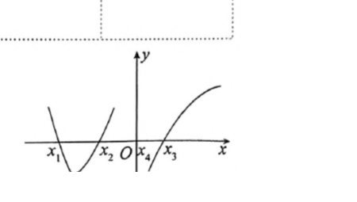

[TOC]

# 高等数学错题本

## 1. 函数极限连续

### 1.1 数列与函数极限

**1.1.1**

设有数列 $\{x_n\}$ 与 $\{y_n\}$，以下结论正确的是

（A）若 $\lim_{n\to\infty}x_ny_n=0$，则必有 $\lim_{n\to\infty}x_n=0$ 或 $\lim_{n\to\infty}y_n=0$。

（B）若 $\lim_{n\to\infty}x_ny_n=\infty$，则必有 $\lim_{n\to\infty}x_n=\infty$ 或 $\lim_{n\to\infty}y_n=\infty$。

（C）若 $x_ny_n$ 有界，则必有 $x_n$ 与 $y_n$ 都有界。

（D）若 $x_ny_n$ 无界，则必有 $x_n$ 无界或 $y_n$ 无界。

**答案**

（D）。

**解析**

用反证法：若 $x_n$ 和 $y_n$ 都有界，则乘积 $x_ny_n$ 必有界，与题设矛盾，故（D）正确。

其余选项可由反例排除。对（A）、（C），可取

$$
x_n:1,0,3,0,\ldots,\qquad y_n:0,2,0,4,\ldots;
$$

此时 $x_ny_n=0$，但 $x_n,y_n$ 均无界且均不趋于 $0$。对（B），可取

$$
x_n:1,1,3,1,\ldots,\qquad y_n:1,2,1,4,\ldots;
$$

此时 $x_ny_n\to\infty$，但 $x_n,y_n$ 均不趋于无穷。

> 来源：27武忠祥《高等数学辅导讲义.严选题》，第一章第 3 题，题目书内第 2 页 / PDF 第 7 页；解析书内第 142 页 / PDF 第 147 页。

**1.1.2**

设 $\lim_{x\to0}\varphi(x)=0$，则下列命题中正确的个数为

（1）$\lim_{x\to0}\frac{\sin\varphi(x)}{\varphi(x)}=1$。

（2）$\lim_{x\to0}(1+\varphi(x))^{\frac{1}{\varphi(x)}}=e$。

（3）若 $f'(x_0)=A$，则 $\lim_{x\to0}\frac{f(x_0+\varphi(x))-f(x_0)}{\varphi(x)}=A$。

（4）若 $\lim_{u\to0}f(u)=A$，则 $\lim_{x\to0}f(\varphi(x))=A$。

（A）0 个。 （B）2 个。 （C）3 个。 （D）4 个。

**答案**

（A），0 个。

**解析**

题目只给出 $\varphi(x)\to0$，没有保证在 $x=0$ 的去心邻域内 $\varphi(x)\ne0$。例如取 $\varphi(x)\equiv0$，前三个式子的分式或幂式没有定义，第（4）个复合极限也不能直接由 $u\to0$ 的去心极限推出。因此四个命题按原条件均不必成立。若补充 $\varphi(x)\ne0$，则四个命题均成立。

> 来源：27武忠祥《高等数学辅导讲义.严选题》，第一章第 7 题，题目书内第 3 页 / PDF 第 8 页；解析书内第 142 页 / PDF 第 147 页。

### 1.2 函数的连续性与间断点

**1.2.1**

设

$$
f(x)=\lim_{n\to\infty}\frac{2e^{(n+1)x}+1}{e^{nx}+x^n+1},
$$

则 $f(x)$

（A）仅有一个可去间断点。 （B）仅有一个跳跃间断点。

（C）有两个可去间断点。 （D）有两个跳跃间断点。

**答案**

（D）。

**解析**

利用 $e^{nx}$ 与 $x^n$ 随 $n\to\infty$ 的变化，得到

$$
f(x)=
\begin{cases}
0, & x<-1,\\
1, & -1<x<0,\\
2e^x, & x>0.
\end{cases}
$$

在 $x=-1$ 处，左右极限分别为 $0$ 和 $1$；在 $x=0$ 处，左右极限分别为 $1$ 和 $2$。两点的左右极限都存在但不相等，故 $x=-1$ 与 $x=0$ 均为跳跃间断点。

> 来源：27武忠祥《高等数学辅导讲义.严选题》，第一章第 18 题，题目书内第 6 页 / PDF 第 11 页；解析书内第 144-145 页 / PDF 第 149-150 页。

### 1.3 连续函数的零点定理与介值定理

**1.3.1**

设 $f(x)$ 在 $[0,2a]$（$a>0$）上连续，且 $f(0)=f(2a)$，求证存在 $\xi\in[0,a]$，使 $f(\xi)=f(\xi+a)$。

**答案**

存在满足条件的 $\xi\in[0,a]$。

**解析**

令

$$
F(x)=f(x)-f(x+a),\qquad x\in[0,a].
$$

则

$$
F(0)=f(0)-f(a),\qquad F(a)=f(a)-f(2a)=f(a)-f(0).
$$

若 $F(0)=0$，取 $\xi=0$ 即可；若 $F(0)\ne0$，则 $F(0)$ 与 $F(a)$ 异号。由连续函数零点定理，存在 $\xi\in(0,a)$ 使 $F(\xi)=0$，即 $f(\xi)=f(\xi+a)$。

> 来源：27武忠祥《高等数学辅导讲义.严选题》，第一章第 48 题，题目书内第 14 页 / PDF 第 19 页；解析书内第 153 页 / PDF 第 158 页。

**1.3.2**

设 $f(x)$ 在 $[a,b]$ 上连续，$x_i\in[a,b]$，$t_i>0$（$i=1,2,\ldots,n$），且 $\sum_{i=1}^n t_i=1$，试证至少存在一点 $\xi\in[a,b]$，使

$$
f(\xi)=t_1f(x_1)+t_2f(x_2)+\cdots+t_nf(x_n).
$$

**答案**

至少存在一点 $\xi\in[a,b]$ 满足所给等式。

**解析**

设 $f(x)$ 在 $[a,b]$ 上的最大值为 $M$，最小值为 $m$。因为 $t_i>0$ 且 $\sum_{i=1}^n t_i=1$，所以

$$
m\le t_1f(x_1)+t_2f(x_2)+\cdots+t_nf(x_n)\le M.
$$

该加权平均值位于 $f$ 的值域 $[m,M]$ 内。由连续函数介值定理，至少存在一点 $\xi\in[a,b]$ 使题设等式成立。

> 来源：27武忠祥《高等数学辅导讲义.严选题》，第一章第 49 题，题目书内第 14 页 / PDF 第 19 页；解析书内第 153 页 / PDF 第 158 页。

## 2. 一元函数微分学

### 2.1 导数的定义与可导性

**2.1.1**

设 $f(x)$ 在 $x=0$ 处连续，则 $f(x)$ 在 $x=0$ 处可导的充分条件是

（A）$\lim_{x\to0}\frac{f(x)-f(-x)}{2x}$ 存在。

（B）$\lim_{x\to0}\frac{f(\ln(1+x^2))-f(0)}{x^2}$ 存在。

（C）$\lim_{x\to0}\frac{f(x)-f(0)}{\sqrt[3]{x}}$ 存在。

（D）$\lim_{x\to\infty}xf\left(\frac1x\right)$ 存在。

**答案**

（D）。

**解析**

由（D）知

$$
\lim_{x\to\infty}xf\left(\frac1x\right)
=\lim_{x\to\infty}\frac{f(1/x)}{1/x}
$$

存在。又 $1/x\to0$，结合 $f$ 在 $0$ 处连续可得 $f(0)=0$。令 $t=1/x$，则

$$
\lim_{t\to0}\frac{f(t)-f(0)}{t}
$$

存在，故 $f'(0)$ 存在。其余条件只考察对称差商、单侧复合路径或比 $x$ 更低阶的分母，均不足以保证可导；例如 $f(x)=|x|$ 可分别排除（A）、（B）、（C）。

> 来源：27武忠祥《高等数学辅导讲义.严选题》，第二章第 1 题，题目书内第 18 页 / PDF 第 23 页；解析书内第 153 页 / PDF 第 158 页。

**2.1.2**

设 $f(x)$ 有连续一阶导数，$f(0)=0$。若当 $x\to0$ 时，$\int_0^{f(x)}f(t)\ dt$ 与 $4x^2$ 为等价无穷小，则 $f'(0)$ 等于

（A）0。 （B）1。 （C）2。 （D）$\frac12$。

**答案**

（C），$f'(0)=2$。

**解析**

由等价无穷小关系，

$$
\lim_{x\to0}\frac{\int_0^{f(x)}f(t)\ dt}{4x^2}=1.
$$

应用洛必达法则，并利用 $f(0)=0$ 与 $f$ 的一阶导数连续，可得

$$
1=\lim_{x\to0}\frac{f(f(x))f'(x)}{8x}=\frac{[f'(0)]^3}{8}.
$$

因此 $f'(0)=2$。

> 来源：27武忠祥《高等数学辅导讲义.严选题》，第二章第 6 题，题目书内第 19 页 / PDF 第 24 页；解析书内第 154 页 / PDF 第 159 页。

**2.1.3**

设

$$
f(x)=\lim_{n\to\infty}\sqrt[n]{1+|x|^n+e^{nx}},
$$

则不可导点的个数为

（A）0。 （B）1。 （C）2。 （D）3。

**答案**

（C），2 个。

**解析**

由有限项非负数的 $n$ 次方和开 $n$ 次方的极限等于各底数的最大值，

$$
f(x)=\max\{1,|x|,e^x\}=
\begin{cases}
-x, & x<-1,\\
1, & -1\le x\le0,\\
e^x, & x>0.
\end{cases}
$$

在 $x=-1$ 和 $x=0$ 处左右导数不相等，故共有 2 个不可导点。

> 来源：27武忠祥《高等数学辅导讲义.严选题》，第二章第 8 题，题目书内第 20 页 / PDF 第 25 页；解析书内第 154 页 / PDF 第 159 页。

**2.1.4**

已知 $f(x)$ 在 $x=0$ 处连续，且

$$
\lim_{x\to0}\frac{x^2}{f(x)}=1,
$$

则下列结论中：

① $f'(0)$ 存在，且 $f'(0)=0$；

② $f''(0)$ 存在，且 $f''(0)=2$；

③ $f(x)$ 在 $x=0$ 处取得极小值；

④ $f''(x)$ 在 $x=0$ 的某邻域内连续。

正确的个数为（A）1。 （B）2。 （C）3。 （D）4。

**答案**

（B），2 个；①、③正确。

**解析**

由 $x^2/f(x)\to1$ 与连续性得 $f(0)=0$，并且

$$
f'(0)=\lim_{x\to0}\frac{f(x)-f(0)}{x}
=\lim_{x\to0}\frac{f(x)}{x^2}x=0,
$$

故①正确。又因 $f(x)\sim x^2>0$，在 $0$ 的某个去心邻域内 $f(x)>0=f(0)$，故③正确。

②不必成立。例如

$$
f(x)=
\begin{cases}
x^2+x^3\sin\frac1x, & x\ne0,\\
0, & x=0,
\end{cases}
$$

满足题设，但 $f''(0)$ 不存在。④也不必成立，例如令 $f(x)=x^2$（$x$ 为有理数），$f(x)=x^2+x^3$（$x$ 为无理数），则题设成立，但函数只在 $x=0$ 处连续。

> 来源：27武忠祥《高等数学辅导讲义.严选题》，第二章第 9 题，题目书内第 20 页 / PDF 第 25 页；解析书内第 154-155 页 / PDF 第 159-160 页。

### 2.2 函数的极值与驻点

**2.2.1**

设函数 $f(x)$ 在 $(-\infty,+\infty)$ 内连续，其导函数的图形如图 1 所示，则 $f(x)$ 有

（A）一个极小值点和两个极大值点。

（B）两个极小值点和一个极大值点。

（C）两个极小值点和两个极大值点。

（D）三个极小值点和一个极大值点。

**答案**

（C）。

**解析**

根据导数在各临界点两侧的符号变化，$f(x)$ 在 $x=x_1$ 和 $x=x_4$ 处由增变减，取得极大值；在 $x=x_2$ 和 $x=x_3$ 处由减变增，取得极小值。因此有两个极小值点和两个极大值点。

> 来源：27武忠祥《高等数学辅导讲义.严选题》，第二章第 10 题（图 1），题目书内第 20 页 / PDF 第 25 页；解析书内第 155 页 / PDF 第 160 页。

**2.2.2**

设函数 $f(x)=|x^2(x+1)|$ 的驻点个数为 $m$，极值点的个数为 $n$，则

（A）$m=1,n=1$。 （B）$m=1,n=2$。 （C）$m=2,n=3$。 （D）$m=3,n=2$。

**答案**

（C），$m=2,n=3$。

**解析**

分段写为

$$
f(x)=
\begin{cases}
-x^2(1+x), & x\le-1,\\
x^2(1+x), & x>-1.
\end{cases}
$$

由 $f'(x)=0$ 得 $x=-\frac23$ 与 $x=0$，二者均为极值点，所以驻点有 2 个。$f'(-1)$ 不存在，但 $x=-1$ 也是极值点。因此极值点共有 3 个。

> 来源：27武忠祥《高等数学辅导讲义.严选题》，第二章第 11 题，题目书内第 21 页 / PDF 第 26 页；解析书内第 155 页 / PDF 第 160 页。

### 2.3 反函数的导数与高阶导数

**2.3.1**

设 $y=f(x)$ 的反函数是 $x=\varphi(y)$，且

$$
f(x)=\int_1^{2x}e^{t^2}\ dt+1,
$$

则 $\varphi''(1)=$ ________。

**答案**

$-\frac1{e^2}$。

**解析**

当 $x=\frac12$ 时 $f(x)=1$。又

$$
f'(x)=2e^{4x^2},\qquad f''(x)=16xe^{4x^2}.
$$

反函数满足

$$
\varphi'(y)=\frac1{f'(x)},\qquad
\varphi''(y)=-\frac{f''(x)}{[f'(x)]^3}.
$$

因此

$$
\varphi''(1)=-\frac{f''(1/2)}{[f'(1/2)]^3}
=-\frac{8e}{8e^3}=-\frac1{e^2}.
$$

> 来源：27武忠祥《高等数学辅导讲义.严选题》，第二章第 23 题，题目书内第 23 页 / PDF 第 28 页；解析书内第 157 页 / PDF 第 162 页。

**2.3.2**

函数

$$
f(x)=\ln|(x-1)(x-2)\cdots(x-n)|
$$

的驻点个数为 ________。

**答案**

$n-1$。

**解析**

令 $g(x)=(x-1)(x-2)\cdots(x-n)$，则在定义域内

$$
f'(x)=\frac{g'(x)}{g(x)}.
$$

因为 $g(1)=g(2)=\cdots=g(n)=0$，由罗尔定理，$g'(x)$ 在每个区间 $(k,k+1)$ 内至少有一个零点，共至少 $n-1$ 个。另一方面，$g'(x)$ 是 $n-1$ 次多项式，至多有 $n-1$ 个零点，故恰有 $n-1$ 个零点，且均不与 $g(x)$ 的零点重合。因此 $f(x)$ 有 $n-1$ 个驻点。

> 来源：27武忠祥《高等数学辅导讲义.严选题》，第二章第 26 题，题目书内第 24 页 / PDF 第 29 页；解析书内第 157 页 / PDF 第 162 页。

### 2.4 中值定理

**2.4.1**

设 $f(x)$ 和 $g(x)$ 在 $[0,1]$ 上连续，在 $(0,1)$ 内可导，$f(0)=f(1)=-1$，且

$$
\int_0^1f(x)\ dx>\frac12.
$$

证明至少存在一点 $\xi\in(0,1)$，使

$$
f'(\xi)+g'(\xi)[f(\xi)-\xi]=1.
$$

**答案**

至少存在一点 $\xi\in(0,1)$ 满足所给等式。

**解析**

令

$$
F(x)=e^{g(x)}[f(x)-x].
$$

由 $f(0)=f(1)=-1$，有 $F(0)<0,F(1)<0$。又

$$
\int_0^1[f(x)-x]\ dx
=\int_0^1f(x)\ dx-\frac12>0,
$$

故至少存在 $c\in(0,1)$ 使 $f(c)-c>0$，从而 $F(c)>0$。由零点定理，存在 $a\in(0,c)$、$b\in(c,1)$ 使 $F(a)=F(b)=0$。再由罗尔定理，存在 $\xi\in(a,b)$ 使 $F'(\xi)=0$。展开即得

$$
e^{g(\xi)}[f'(\xi)-1]+e^{g(\xi)}g'(\xi)[f(\xi)-\xi]=0,
$$

所以题设等式成立。

> 来源：27武忠祥《高等数学辅导讲义.严选题》，第二章第 45 题，题目书内第 28 页 / PDF 第 33 页；解析书内第 161 页 / PDF 第 166 页。

**2.4.2**

设 $f(x),g(x)$ 在 $[0,1]$ 上连续，在 $(0,1)$ 内可导，且

$$
\int_0^1f(x)\ dx=3\int_{2/3}^1f(x)\ dx.
$$

试证存在 $\xi,\eta\in(0,1)$，使得

$$
f'(\xi)=g'(\xi)[f(\eta)-f(\xi)].
$$

**答案**

存在满足条件的 $\xi,\eta\in(0,1)$。

**解析**

由积分等式得

$$
\int_0^{2/3}f(x)\ dx=2\int_{2/3}^1f(x)\ dx.
$$

由积分中值定理，存在 $c\in(0,2/3)$、$\eta\in(2/3,1)$，使

$$
\frac23f(c)=\frac23f(\eta),
$$

即 $f(c)=f(\eta)$。令

$$
F(x)=e^{g(x)}[f(x)-f(\eta)].
$$

则 $F(c)=F(\eta)=0$。由罗尔定理，存在 $\xi\in(c,\eta)$ 使 $F'(\xi)=0$，即

$$
f'(\xi)=g'(\xi)[f(\eta)-f(\xi)].
$$

> 来源：27武忠祥《高等数学辅导讲义.严选题》，第二章第 46 题，题目书内第 28 页 / PDF 第 33 页；解析书内第 161 页 / PDF 第 166 页。

### 2.5 泰勒公式

**2.5.1**

设 $f(x)$ 在 $[0,1]$ 上二阶可导，$f(0)=f(1)=0$，$\max_{0\le x\le1}f(x)=2$。试证存在 $\xi\in(0,1)$，使得 $f''(\xi)\le-16$。

**答案**

存在一点 $\xi\in(0,1)$，使 $f''(\xi)\le-16$。

**解析**

设 $f(c)=\max_{0\le x\le1}f(x)=2$，则 $0<c<1$ 且 $f'(c)=0$。分别在 $x=0$ 与 $x=1$ 处对 $f$ 在 $c$ 点使用带拉格朗日余项的泰勒公式，得到

$$
f''(\xi_1)=-\frac4{c^2},\quad \xi_1\in(0,c),
$$

以及

$$
f''(\xi_2)=-\frac4{(1-c)^2},\quad \xi_2\in(c,1).
$$

若 $c\le\frac12$，则 $f''(\xi_1)\le-16$；若 $c>\frac12$，则 $f''(\xi_2)\le-16$。故结论成立。

> 来源：27武忠祥《高等数学辅导讲义.严选题》，第二章第 53 题，题目书内第 30 页 / PDF 第 35 页；解析书内第 163 页 / PDF 第 168 页。

**2.5.2**

设 $f(x)$ 在 $[0,2]$ 上二阶可导，且 $|f(x)|\le1$，$|f''(x)|\le1$。证明

$$
|f'(x)|\le2,\qquad 0\le x\le2.
$$

**答案**

对任意 $x\in[0,2]$，均有 $|f'(x)|\le2$。

**解析**

固定 $x\in[0,2]$。分别在 $0$ 和 $2$ 处对 $f$ 在 $x$ 点使用带拉格朗日余项的泰勒公式：

$$
f(0)=f(x)-xf'(x)+\frac{f''(\xi_1)}2x^2,
$$

$$
f(2)=f(x)+(2-x)f'(x)+\frac{f''(\xi_2)}2(2-x)^2.
$$

第二式减第一式，整理并取绝对值得

$$
|f'(x)|
\le\frac{|f(0)|+|f(2)|}{2}
+\frac14\left[|f''(\xi_2)|(2-x)^2+|f''(\xi_1)|x^2\right].
$$

利用 $|f|\le1$、$|f''|\le1$ 以及 $(2-x)^2+x^2\le4$，得

$$
|f'(x)|\le1+\frac14\left[(2-x)^2+x^2\right]\le2.
$$

> 来源：27武忠祥《高等数学辅导讲义.严选题》，第二章第 54 题，题目书内第 30 页 / PDF 第 35 页；解析书内第 163 页 / PDF 第 168 页。

## 3. 一元函数积分学

### 3.2 定积分

**3.2.1**

设 $f(x)$ 在 $[0,1]$ 上连续，在 $(0,1)$ 内可导，且满足

$$
f(1)=k\int_0^{\frac1k}xe^{1-x}f(x)\ \mathrm{d}x\qquad(k>1).
$$

证明至少存在一点 $\xi\in(0,1)$，使得

$$
f'(\xi)=(1-\xi^{-1})f(\xi).
$$

**答案**

存在 $\xi\in(0,1)$ 满足 $f'(\xi)=(1-\xi^{-1})f(\xi)$。

**解析**

由积分中值定理，存在 $\xi_1\in[0,1/k]$，使

$$
f(1)=k\int_0^{\frac1k}xe^{1-x}f(x)\ \mathrm{d}x
=\xi_1e^{1-\xi_1}f(\xi_1).
$$

令 $\varphi(x)=xe^{1-x}f(x)$。则 $\varphi(\xi_1)=f(1)=\varphi(1)$。由罗尔定理，存在 $\xi\in(\xi_1,1)\subset(0,1)$，使 $\varphi'(\xi)=0$。于是

$$
e^{1-\xi}\bigl[f(\xi)-\xi f(\xi)+\xi f'(\xi)\bigr]=0,
$$

即 $f'(\xi)=(1-\xi^{-1})f(\xi)$。

> 来源：27武忠祥《高等数学辅导讲义.严选题》，第三章第 45 题，题目书内第 45 页 / PDF 第 50 页；解析书内第 169 页 / PDF 第 174 页。

**3.2.2**

设函数 $f(x)$ 在 $[0,1]$ 上有连续一阶导数，且 $f(0)=0$，试证至少存在一点 $\xi\in[0,1]$，使

$$
f'(\xi)=2\int_0^1f(x)\ \mathrm{d}x.
$$

**答案**

存在 $\xi\in[0,1]$ 满足 $f'(\xi)=2\int_0^1f(x)\ \mathrm{d}x$。

**解析**

由 $f(0)=0$，有 $f(x)=\int_0^x f'(t)\ \mathrm{d}t$。交换积分次序得

$$
\int_0^1f(x)\ \mathrm{d}x
=\int_0^1(1-t)f'(t)\ \mathrm{d}t.
$$

因 $f'$ 连续且 $1-t\geq0$，积分中值定理给出某个 $\xi\in[0,1]$，使

$$
\int_0^1(1-t)f'(t)\ \mathrm{d}t
=f'(\xi)\int_0^1(1-t)\ \mathrm{d}t
=\frac12f'(\xi).
$$

故 $f'(\xi)=2\int_0^1f(x)\ \mathrm{d}x$。

> 来源：27武忠祥《高等数学辅导讲义.严选题》，第三章第 50 题，题目书内第 47 页 / PDF 第 52 页；解析书内第 170 页 / PDF 第 175 页。

**3.2.3**

设函数 $f(x)$ 在 $[-l,l]$ 上连续，在 $x=0$ 处可导，且 $f'(0)\ne0$。

（1）证明：对任意 $x\in(0,l)$，至少存在 $\theta\in(0,1)$，使得

$$
=x[f(\theta x)-f(-\theta x)];
\int_0^x f(t)\ \mathrm{d}t+\int_0^{-x}f(t)\ \mathrm{d}t
=x[f(\theta x)-f(-\theta x)];
=x[f(\theta x)-f(-\theta x)];
$$

（2）求极限

$$
\lim_{x\to0^+}\theta.
$$

**答案**

（1）对每个 $x\in(0,l)$ 存在 $\theta\in(0,1)$ 满足等式；（2）$\displaystyle\lim_{x\to0^+}\theta=\frac12$。

**解析**

令

$$
F(u)=\int_0^u f(t)\ \mathrm{d}t+\int_0^{-u}f(t)\ \mathrm{d}t.
$$

则 $F(0)=0$，且 $F'(u)=f(u)-f(-u)$。对区间 $[0,x]$ 用拉格朗日中值定理，得某个 $\theta\in(0,1)$ 使

$$
F(x)=xF'(\theta x)=x[f(\theta x)-f(-\theta x)].
$$

又由 $f$ 在 $0$ 处可导，设 $h=\theta x$，则

$$
\frac{f(h)-f(-h)}{2h}\to f'(0).
$$

同时

$$
\frac{F(x)}{2x^2}=\frac{f(x)-f(-x)}{4x}\to\frac12f'(0).
$$

将 $F(x)=x[f(\theta x)-f(-\theta x)]$ 除以 $2x^2$，结合 $f'(0)\ne0$，得到 $\theta\to\frac12$。

> 来源：27武忠祥《高等数学辅导讲义.严选题》，第三章第 51 题，题目书内第 47 页 / PDF 第 52 页；解析书内第 171 页 / PDF 第 176 页。

**3.2.4**

设 $f(x)$ 在 $[0,2\pi]$ 上具有二阶连续导数，且 $f''(x)>0$，证明

$$
\int_{0}^{2\pi}f(x)\cos x\ \mathrm{d}x\geqslant 0.
$$

**答案**

积分值满足 $\displaystyle\int_{0}^{2\pi}f(x)\cos x\ \mathrm{d}x\geqslant0$。

**解析**

连续分部积分两次，并利用 $\sin0=\sin2\pi=0$、$\cos0=\cos2\pi=1$，得

$$
\begin{aligned}
\int_0^{2\pi}f(x)\cos x\ \mathrm{d}x
&=-\int_0^{2\pi}f'(x)\sin x\ \mathrm{d}x\\
&=f'(2\pi)-f'(0)-\int_0^{2\pi}f''(x)\cos x\ \mathrm{d}x\\
&=\int_0^{2\pi}f''(x)(1-\cos x)\ \mathrm{d}x.
\end{aligned}
$$

因 $f''(x)>0$ 且 $1-\cos x\geq0$，故积分非负。

> 来源：27武忠祥《高等数学辅导讲义.严选题》，第三章第 52 题，题目书内第 48 页 / PDF 第 53 页；解析书内第 172 页 / PDF 第 177 页。

**3.2.5**

设函数 $f(x)$ 在区间 $[0,1]$ 上可导，且 $|f'(x)|<M$，证明

$$
\left|\int_0^1f(x)\ \mathrm{d}x-\frac{1}{n}\sum_{k=1}^{n}f\left(\frac{k}{n}\right)\right|
\leqslant\frac{M}{2n}.
$$

**答案**

不等式 $\displaystyle\left|\int_0^1f(x)\ \mathrm{d}x-\frac{1}{n}\sum_{k=1}^{n}f(k/n)\right|\leqslant M/(2n)$ 成立。

**解析**

将积分按等分区间展开，并在每个区间使用拉格朗日中值定理：

$$
\begin{aligned}
\left|\int_0^1f(x)\ \mathrm{d}x-\frac1n\sum_{k=1}^nf\left(\frac{k}{n}\right)\right|
&\leq\sum_{k=1}^n\int_{\frac{k-1}{n}}^{\frac{k}{n}}\left|f(x)-f\left(\frac{k}{n}\right)\right|\ \mathrm{d}x\\
&\leq M\sum_{k=1}^n\int_{\frac{k-1}{n}}^{\frac{k}{n}}\left(\frac{k}{n}-x\right)\ \mathrm{d}x\\
&=M\sum_{k=1}^n\frac{1}{2n^2}=\frac{M}{2n}.
\end{aligned}
$$

> 来源：27武忠祥《高等数学辅导讲义.严选题》，第三章第 53 题，题目书内第 48 页 / PDF 第 53 页；解析书内第 172 页 / PDF 第 177 页。

**3.2.6**

设 $f(x)$ 满足 $f(1)=1$，$f'(x)=\frac{1}{x^2+f^2(x)}$（$x\geqslant1$），试证 $\lim_{x\to+\infty}f(x)$ 存在且不超过 $1+\frac{\pi}{4}$。

**答案**

极限存在，且 $\displaystyle\lim_{x\to+\infty}f(x)\leqslant1+\frac{\pi}{4}$。

**解析**

由 $f'(x)>0$，知 $f$ 在 $[1,+\infty)$ 上递增，从而 $f(x)\geq f(1)=1$。因此

$$
0<f'(x)=\frac{1}{x^2+f^2(x)}\leq\frac{1}{x^2+1}.
$$

积分得

$$
0<f(x)-1\leq\int_1^x\frac{\mathrm{d}t}{t^2+1}<\int_1^{+\infty}\frac{\mathrm{d}t}{1+t^2}=\frac{\pi}{4}.
$$

故 $f$ 单调有上界，极限存在，且不超过 $1+\frac{\pi}{4}$。

> 来源：27武忠祥《高等数学辅导讲义.严选题》，第三章第 54 题，题目书内第 49 页 / PDF 第 53 页；解析书内第 172 页 / PDF 第 177 页。

### 3.3 反常积分

**3.3.1**

若

$$
\int_{0}^{x}f(t)\ \mathrm{d}t=xe^{-x},
$$

则

$$
\int_{1}^{+\infty}\frac{f(\ln x)}{x}\ \mathrm{d}x
=\underline{\qquad}.
$$

**答案**

$0$。

**解析**

由微积分基本定理，$f(x)=(xe^{-x})'=e^{-x}(1-x)$。令 $u=\ln x$，则 $\mathrm{d}u=\mathrm{d}x/x$，且

$$
\int_1^{+\infty}\frac{f(\ln x)}{x}\ \mathrm{d}x
=\int_0^{+\infty}f(u)\ \mathrm{d}u
=\left.ue^{-u}\right|_0^{+\infty}=0.
$$

> 来源：27武忠祥《高等数学辅导讲义.严选题》，第三章第 30 题，题目书内第 42 页 / PDF 第 47 页；解析书内第 167 页 / PDF 第 172 页。

### 3.4 定积分应用

**3.4.1**

（数学三不要求）一容器的内侧是由图中曲线绕 $y$ 轴旋转一周而成的曲面，该曲线由

$$
x^2+y^2=2y\quad\left(y\geqslant\frac12\right)
$$

与

$$
x^2+y^2=1\quad\left(y\leqslant\frac12\right)
$$

连接而成。

（1）求容器的容积；

（2）若将容器内盛满的水从容器顶部全部抽出，至少需要做多少功？

（长度单位：$m$，重力加速度为 $g\ \mathrm{m/s^2}$，水的密度为 $10^3\ \mathrm{kg/m^3}$。）

**答案**

（1）容积为 $\frac{9\pi}{4}\ \mathrm{m^3}$；（2）最少功为 $\frac{27\times10^3}{8}\pi g\ \mathrm{J}$。

**解析**

由旋转对称性，低部 $-1\le y\le\frac12$ 的截面半径满足 $x^2=1-y^2$，高部 $\frac12\le y\le2$ 的截面半径满足 $x^2=1-(1-y)^2$。故

$$
V=\pi\int_{-1}^{\frac12}(1-y^2)\ \mathrm{d}y+\pi\int_{\frac12}^{2}\bigl[1-(1-y)^2\bigr]\ \mathrm{d}y=\frac{9\pi}{4}.
$$

水在高度 $y$ 处被提升至顶部 $y=2$，故功为

$$
\begin{aligned}
W
&=10^3\pi g\left[\int_{-1}^{\frac12}(1-y^2)(2-y)\ \mathrm{d}y
+\int_{\frac12}^{2}\bigl[1-(1-y)^2\bigr](2-y)\ \mathrm{d}y\right]\\
&=\frac{27\times10^3}{8}\pi g\ \mathrm{J}.
\end{aligned}
$$

> 来源：27武忠祥《高等数学辅导讲义.严选题》，第三章第 55 题，题目书内第 49 页 / PDF 第 54 页；解析书内第 172 页 / PDF 第 177 页。

## 4. 常微分方程

### 4.1 微分方程与极限

**4.1.1**

设函数 $y(x)$ 满足 $y''+(x-1)y'+x^2y=e^x$，且 $y'(0)=1$．若

$$
\lim_{x\to0}\frac{y(x)-x}{x^2}=a,
$$

则 $a=$__________．

**答案**

$a=1$。

**解析**

由极限为有限值可知 $y(0)=0$。在微分方程中令 $x=0$，利用 $y'(0)=1$，得 $y''(0)=2$。由二阶泰勒公式，

$$
y(x)=x+\frac{y''(0)}2x^2+o(x^2)=x+x^2+o(x^2).
$$

故 $a=1$。

> 来源：27武忠祥《高等数学辅导讲义.严选题》，第四章第 13 题，题目书内第 57 页 / PDF 第 62 页；解析书内第 175 页 / PDF 第 180 页。

### 4.2 交换自变量与因变量

**4.2.1**

求微分方程

$$
y''+(x+e^{2y})y'^3=0
$$

的通解．

**答案**

非恒定解的通解可隐式写为

$$
x=C_1e^y+C_2e^{-y}+\frac13e^{2y}.
$$

此外，$y\equiv C$ 也是原方程的解。

**解析**

在 $y'\ne0$ 的区间内把 $x$ 看作 $y$ 的函数，以 $x_y,x_{yy}$ 表示对 $y$ 的导数，则

$$
y'=\frac1{x_y},\qquad y''=-\frac{x_{yy}}{x_y^3}.
$$

代入原方程并乘以 $x_y^3$，得

$$
x_{yy}-x=e^{2y}.
$$

齐次解为 $C_1e^y+C_2e^{-y}$，设特解为 $Ae^{2y}$，代入得 $3A=1$，从而得到答案中的隐式通解。交换变量时除去了 $y'=0$ 的情形，因此另补恒定解 $y\equiv C$。

> 来源：27武忠祥《高等数学辅导讲义.严选题》，第四章第 20 题，题目书内第 59 页 / PDF 第 64 页；解析书内第 175 页 / PDF 第 180 页。

### 4.3 积分方程与函数方程

**4.3.1**

设 $f(x)$ 为连续函数，且满足

$$
f(x)=e^x+e^x\int_0^x[f(t)]^2\ dt.
$$

试求 $f(x)$。

**答案**

$$
f(x)=\frac{2e^x}{3-e^{2x}}\qquad\left(x<\frac12\ln3\right).
$$

**解析**

原式给出 $f(0)=1$，且两边求导后有

$$
f'(x)=f(x)+e^x f^2(x).
$$

令 $u=1/f$，得到一阶线性方程 $u'+u=-e^x$，解得

$$
u=Ce^{-x}-\frac12e^x.
$$

由 $u(0)=1$ 得 $C=\frac32$，故得所求函数。包含 $0$ 的最大连续解区间为 $(-\infty,\frac12\ln3)$；在该区间代回原积分等式成立。

> 来源：27武忠祥《高等数学辅导讲义.严选题》，第四章第 23 题，题目书内第 60 页 / PDF 第 65 页；解析书内第 176 页 / PDF 第 181 页。

**4.3.2**

设 $f(x)$ 在 $(-\infty,+\infty)$ 上有定义，$f'(0)=2$，对任意的 $x,y$ 有

$$
f(x+y)=e^x f(y)+e^y f(x),
$$

求 $f(x)$。

**答案**

$f(x)=2xe^x$。

**解析**

令 $x=y=0$，得 $f(0)=0$。由函数方程及 $f'(0)=2$，对任意 $x$，

$$
\begin{aligned}
f'(x)&=\lim_{h\to0}\frac{e^xf(h)+(e^h-1)f(x)}h\\
&=2e^x+f(x).
\end{aligned}
$$

于是 $(e^{-x}f(x))'=2$，积分并用 $f(0)=0$ 得 $f(x)=2xe^x$。

> 来源：27武忠祥《高等数学辅导讲义.严选题》，第四章第 26 题，题目书内第 60 页 / PDF 第 65 页；解析书内第 176-177 页 / PDF 第 181-182 页。

## 5. 多元函数微分学

### 5.1 偏导数、连续与可微

**5.1.1**

设函数 $z=f(x,y)$ 在点 $(x_0,y_0)$ 处有 $f_x(x_0,y_0)=a,f_y(x_0,y_0)=b$，则下列结论正确的是

（A） $\displaystyle\lim_{\substack{x\to x_0\\y\to y_0}}f(x,y)$ 存在，但 $f(x,y)$ 在 $(x_0,y_0)$ 处不一定连续．

（B） $f(x,y)$ 在 $(x_0,y_0)$ 处连续．

（C） $\left.dz\right|_{(x_0,y_0)}=a\ dx+b\ dy$．

（D） $\displaystyle\lim_{x\to x_0}f(x,y_0)$ 及 $\displaystyle\lim_{y\to y_0}f(x_0,y)$ 都存在且相等．

**答案**

（D）。

**解析**

偏导数存在意味着固定另一个变量所得的一元函数在相应点可导，因而连续，所以

$$
\lim_{x\to x_0}f(x,y_0)=f(x_0,y_0)=\lim_{y\to y_0}f(x_0,y).
$$

偏导数存在不能保证二重极限存在，也不能保证二元函数连续或可微。例如在原点取值为 $0$、其余点取值为 $xy/(x^2+y^2)$ 的函数，在原点两个偏导数均存在，而二重极限不存在。

> 来源：27武忠祥《高等数学辅导讲义.严选题》，第五章第 2 题，题目书内第 67 页 / PDF 第 72 页；解析书内第 179 页 / PDF 第 184 页。

**5.1.2**

设

$$
f(x,y)=
\begin{cases}
(x^2+y^2)\sin\frac{1}{x^2+y^2}, & (x,y)\ne(0,0),\\
0, & (x,y)=(0,0),
\end{cases}
$$

则 $f(x,y)$ 在 $(0,0)$ 处

（A） 两个偏导数不存在．

（B） 两个偏导数存在但不可微．

（C） 偏导数连续．

（D） 可微但偏导数不连续．

**答案**

（D），可微但偏导数不连续。

**解析**

按定义可得 $f_x(0,0)=f_y(0,0)=0$。令 $r=\sqrt{x^2+y^2}$，则

$$
\left|\frac{f(x,y)-f(0,0)-0x-0y}{r}\right|\le r\to0,
$$

故函数在原点可微。当 $(x,y)\ne(0,0)$ 时，

$$
f_x(x,y)=2x\sin\frac1{x^2+y^2}-\frac{2x}{x^2+y^2}\cos\frac1{x^2+y^2}.
$$

沿 $y=0$ 趋近原点，第二项振荡且无极限，故 $f_x$ 在原点不连续；同理 $f_y$ 也不连续。

> 来源：27武忠祥《高等数学辅导讲义.严选题》，第五章第 4 题，题目书内第 68 页 / PDF 第 73 页；解析书内第 180 页 / PDF 第 185 页。

### 5.2 复合函数与隐函数求导

**5.2.1**

设 $u=f(x,y,z)$ 有连续的一阶偏导数，又函数 $y=y(x)$ 及 $z=z(x)$ 分别由

$$
e^{xy}-xy=2
$$

和

$$
e^x=\int_0^{x-z}\frac{\sin t}{t}\ dt
$$

确定．求 $\frac{du}{dx}$．

**答案**

$$
\frac{du}{dx}=f_x-\frac yx f_y+\left[1-\frac{e^x(x-z)}{\sin(x-z)}\right]f_z,
$$

其中各偏导数均在 $(x,y(x),z(x))$ 处取值。

**解析**

对 $e^{xy}-xy=2$ 求导得

$$
(e^{xy}-1)(y+xy')=0.
$$

由原方程可知 $xy\ne0$，且 $e^{xy}\ne1$，因此 $y'=-y/x$。再对确定 $z$ 的等式求导，得

$$
e^x=\frac{\sin(x-z)}{x-z}(1-z'),\qquad z'=1-\frac{e^x(x-z)}{\sin(x-z)}.
$$

利用复合函数求导公式 $du/dx=f_x+f_y y'+f_z z'$ 即得结果。

> 来源：27武忠祥《高等数学辅导讲义.严选题》，第五章第 31 题，题目书内第 75 页 / PDF 第 80 页；解析书内第 184 页 / PDF 第 189 页。

**5.2.2**

设变换

$$
\begin{cases}
u=x-2y,\\
v=x+ay
\end{cases}
\quad (a\ne-2)
$$

可把方程

$$
6\frac{\partial^2z}{\partial x^2}+\frac{\partial^2z}{\partial x\partial y}-\frac{\partial^2z}{\partial y^2}=0
$$

简化为

$$
\frac{\partial^2z}{\partial u\partial v}=0,
$$

求常数 $a$。

**答案**

$a=3$。

**解析**

由 $u=x-2y,v=x+ay$，链式法则给出

$$
\begin{aligned}
z_{xx}&=z_{uu}+2z_{uv}+z_{vv},\\
z_{xy}&=-2z_{uu}+(a-2)z_{uv}+az_{vv},\\
z_{yy}&=4z_{uu}-4az_{uv}+a^2z_{vv}.
\end{aligned}
$$

代入原方程得到

$$
(10+5a)z_{uv}+(6+a-a^2)z_{vv}=0.
$$

要化为 $z_{uv}=0$，须 $6+a-a^2=0$ 且 $10+5a\ne0$。解得 $a=3$（$a=-2$ 已被排除）。

> 来源：27武忠祥《高等数学辅导讲义.严选题》，第五章第 32 题，题目书内第 76 页 / PDF 第 81 页；解析书内第 184 页 / PDF 第 189 页。

### 5.3 最值与不等式

**5.3.1**

求函数

$$
f(x,y)=x^2+2y^2-x^2y^2
$$

在区域

$$
D=\{(x,y)\mid x^2+y^2\le4,\ y\ge0\}
$$

上的最大值和最小值。

**答案**

最大值为 $8$，在 $(0,2)$ 处取得；最小值为 $0$，在 $(0,0)$ 处取得。

**解析**

区域内部的驻点由 $2x(1-y^2)=0,2y(2-x^2)=0$ 得到，为 $(\pm\sqrt2,1)$，对应函数值为 $2$。

直径边界 $y=0,-2\le x\le2$ 上，$f(x,0)=x^2$，取值范围为 $[0,4]$。半圆边界上 $y^2=4-x^2$，于是

$$
f\left(x,\sqrt{4-x^2}\right)=x^4-5x^2+8.
$$

令 $t=x^2\in[0,4]$，得 $t^2-5t+8$ 的最小值为 $\frac74$、最大值为 $8$。比较内部驻点和两段边界上的函数值，得到全区域的最大值 $8$、最小值 $0$。

> 来源：27武忠祥《高等数学辅导讲义.严选题》，第五章第 42 题，题目书内第 78 页 / PDF 第 83 页；解析书内第 186 页 / PDF 第 191 页。

**5.3.2**

已知 $p>1$，

$$
\frac{1}{p}+\frac{1}{q}=1,\quad x,y>0.
$$

求证：

$$
xy\le\frac{x^p}{p}+\frac{y^q}{q}.
$$

**答案**

不等式成立，等号当且仅当 $x^p=y^q$ 时成立。

**解析**

固定 $y>0$，令

$$
\varphi(x)=\frac{x^p}{p}+\frac{y^q}{q}-xy,\qquad x>0.
$$

则 $\varphi'(x)=x^{p-1}-y$，在 $x_*=y^{1/(p-1)}$ 两侧分别为负、正，故该点为全局最小值点。由 $q=p/(p-1)$，有 $x_*^p=x_*y=y^q$，从而

$$
\varphi(x_*)=y^q\left(\frac1p+\frac1q-1\right)=0.
$$

因此 $\varphi(x)\ge0$，即所求不等式成立。

> 来源：27武忠祥《高等数学辅导讲义.严选题》，第五章第 49 题，题目书内第 79 页 / PDF 第 84 页；解析书内第 187-188 页 / PDF 第 192-193 页。

**5.3.3**

设 $f(x,y)$ 在圆域 $x^2+y^2\leqslant1$ 上有连续一阶偏导数，且 $|f(x,y)|\leqslant1$。求证在单位圆内至少有一点 $(x_0,y_0)$ 可使

$$
\left[\frac{\partial f(x_0,y_0)}{\partial x}\right]^2+
\left[\frac{\partial f(x_0,y_0)}{\partial y}\right]^2<16.
$$

**答案**

单位圆内部至少存在一点 $(x_0,y_0)$ 满足所给严格不等式。

**解析**

构造 $g(x,y)=f(x,y)+2(x^2+y^2)$。在边界 $x^2+y^2=1$ 上有 $g\ge1$，而 $g(0,0)\le1$。若全局最小值小于 $1$，其最小值点必在内部；若全局最小值等于 $1$，则原点就是一个内部最小值点。因此总能选取内部最小值点 $(x_0,y_0)$。

由费马定理，$g_x(x_0,y_0)=g_y(x_0,y_0)=0$，即

$$
f_x(x_0,y_0)=-4x_0,\qquad f_y(x_0,y_0)=-4y_0.
$$

所以

$$
f_x^2(x_0,y_0)+f_y^2(x_0,y_0)=16(x_0^2+y_0^2)<16.
$$

> 来源：27武忠祥《高等数学辅导讲义.严选题》，第五章第 52 题，题目书内第 80 页 / PDF 第 85 页；解析书内第 188 页 / PDF 第 193 页。

## 6. 二重积分

### 6.1 积分和的极限与交换积分次序

**6.1.1**

求极限

$$
\lim_{n\to\infty}\frac{1}{n}\left(
\int_1^{\frac1n}e^{-y^2}\ dy+
\int_1^{\frac2n}e^{-y^2}\ dy+
\cdots+
\int_1^{\frac{n-1}{n}}e^{-y^2}\ dy
\right).
$$

**答案**

$\frac12(e^{-1}-1)$。

**解析**

令 $F(x)=\int_1^xe^{-y^2}\ \mathrm{d}y$，则 $F$ 在 $[0,1]$ 上连续，且 $F(1)=0$。原式是 $F$ 的积分和，故

$$
\begin{aligned}
\lim_{n\to\infty}\frac1n\sum_{k=1}^{n-1}F\left(\frac kn\right)
&=\int_0^1F(x)\ \mathrm{d}x\\
&=-\int_0^1\mathrm{d}x\int_x^1e^{-y^2}\ \mathrm{d}y\\
&=-\int_0^1\mathrm{d}y\int_0^ye^{-y^2}\ \mathrm{d}x\\
&=-\int_0^1ye^{-y^2}\ \mathrm{d}y=\frac12(e^{-1}-1).
\end{aligned}
$$

> 来源：27武忠祥《高等数学辅导讲义.严选题》，第六章第 23 题，题目书内第 91 页 / PDF 第 96 页；解析书内第 191 页 / PDF 第 196 页。

### 6.2 二重积分不等式

**6.2.1**

设 $D=\{(x,y)\mid0\le x\le2,0\le y\le2\}$，记

$$
b=\iint_D|xy-1|\ \mathrm{d}\sigma.
$$

（2）设 $f(x,y)$ 在 $D$ 上连续，且

$$
\iint_Df(x,y)\ \mathrm{d}\sigma=0,\qquad \iint_Dxyf(x,y)\ \mathrm{d}\sigma=1.
$$

证明：存在 $(\xi,\eta)\in D$ 使 $|f(\xi,\eta)|\ge\frac1b$。

**答案**

存在 $(\xi,\eta)\in D$，使 $|f(\xi,\eta)|\ge\frac1b$。

**解析**

由于 $D$ 为有界闭区域，$|f|$ 在 $D$ 上取得最大值 $M=|f(\xi,\eta)|$。由两个积分条件，

$$
\iint_D(xy-1)f(x,y)\ \mathrm{d}\sigma=1.
$$

因此

$$
1\le\iint_D|xy-1||f(x,y)|\ \mathrm{d}\sigma\le M\iint_D|xy-1|\ \mathrm{d}\sigma=Mb.
$$

又 $b>0$，故 $M\ge1/b$，即得结论。

> 来源：27武忠祥《高等数学辅导讲义.严选题》，第六章第 39 题（2），题目书内第 95 页 / PDF 第 100 页；解析书内第 194 页 / PDF 第 199 页。

**6.2.2**

设 $f(x),g(x)$ 在 $[0,1]$ 上连续，且同时单调增，证明：

$$
\int_0^1f(x)g(x)\ dx\geq
\left(\int_0^1f(x)\ dx\right)
\left(\int_0^1g(x)\ dx\right).
$$

**答案**

所给不等式成立。

**解析**

记两边之差为 $I$，在单位正方形 $D=[0,1]^2$ 上将乘积积分写为二重积分，并交换 $x,y$ 后取平均，得

$$
\begin{aligned}
I&=\iint_Df(x)[g(x)-g(y)]\ \mathrm{d}x\ \mathrm{d}y\\
&=\frac12\iint_D[f(x)-f(y)][g(x)-g(y)]\ \mathrm{d}x\ \mathrm{d}y.
\end{aligned}
$$

因为 $f,g$ 同时单调增，两个差值始终同号或为零，被积函数非负，故 $I\ge0$。

> 来源：27武忠祥《高等数学辅导讲义.严选题》，第六章第 40 题，题目书内第 95 页 / PDF 第 100 页；解析书内第 194 页 / PDF 第 199 页。

## 7. 无穷级数

### 7.1 数项级数的性质与判别

**7.1.1**

下列命题正确的是

（A） 若正项级数 $\sum_{n=1}^{\infty}a_n$ 发散，则 $a_n\geq\frac{1}{n}\ (n>N)$。

（B） 若 $\sum_{n=1}^{\infty}(a_{2n-1}+a_{2n})$ 收敛，则 $\sum_{n=1}^{\infty}a_n$ 收敛。

（C） 若 $\sum_{n=1}^{\infty}a_n$ 与 $\sum_{n=1}^{\infty}b_n$ 至少有一个发散，则 $\sum_{n=1}^{\infty}(|a_n|+|b_n|)$ 发散。

（D） 若 $\sum_{n=1}^{\infty}|a_nb_n|$ 收敛，则 $\sum_{n=1}^{\infty}a_n^2$ 与 $\sum_{n=1}^{\infty}b_n^2$ 都收敛。

**答案**

（C）。

**解析**

若 $\sum(|a_n|+|b_n|)$ 收敛，则由比较判别法，$\sum|a_n|$ 与 $\sum|b_n|$ 都收敛，从而 $\sum a_n$ 与 $\sum b_n$ 都收敛，与条件矛盾，故（C）正确。

（A）可取 $a_n=1/(2n)$；（B）可取 $a_n=(-1)^{n-1}$，每组之和为零而原级数发散；（D）可取 $a_n=1,b_n=1/n^2$，乘积绝对可和，但 $\sum a_n^2$ 发散。

> 来源：27武忠祥《高等数学辅导讲义.严选题》，第七章第 1 题，题目书内第 99 页 / PDF 第 104 页；解析书内第 194-195 页 / PDF 第 199-200 页。

**7.1.2**

设有命题

(1) 若 $\sum_{n=1}^{\infty}a_n$ 收敛，则 $\sum_{n=1}^{\infty}\frac{(-1)^n}{\sqrt{n}}a_n$ 收敛。

(2) 若正项级数 $\sum_{n=1}^{\infty}a_n$ 满足 $\frac{a_{n+1}}{a_n}<1(n=1,2,\cdots)$，则 $\sum_{n=1}^{\infty}a_n$ 收敛。

(3) 若 $\lim_{n\to\infty}\frac{u_n}{v_n}=l\ne0$，则 $\sum_{n=1}^{\infty}u_n$ 与 $\sum_{n=1}^{\infty}v_n$ 同敛散。

(4) 若 $a_n\leq b_n\leq c_n(n=1,2,\cdots)$ 且 $\sum_{n=1}^{\infty}a_n$ 与 $\sum_{n=1}^{\infty}c_n$ 都收敛，则 $\sum_{n=1}^{\infty}b_n$ 收敛。

则上述命题中正确的个数为

（A）0.　　　　　　　　　(B)1.　　　　　　　　　(C)2.　　　　　　　　　(D)3.

**答案**

（B），只有命题（4）正确。

**解析**

对（4），由 $0\le b_n-a_n\le c_n-a_n$，且 $\sum(c_n-a_n)$ 收敛，比较判别法得 $\sum(b_n-a_n)$ 收敛，再与 $\sum a_n$ 相加即得 $\sum b_n$ 收敛。

其余命题可分别用反例排除：

（1）取 $a_n=(-1)^n/\sqrt n$，原级数收敛，乘以 $(-1)^n/\sqrt n$ 后成为调和级数。

（2）取 $a_n=1/n$，虽有 $a_{n+1}/a_n<1$，级数仍发散。

（3）取 $v_n=(-1)^n/\sqrt n$，$u_n=v_n+1/n$，则 $u_n/v_n\to1$，但 $\sum v_n$ 收敛、$\sum u_n$ 发散。极限比较判别法不能直接用于一般变号级数。

> 来源：27武忠祥《高等数学辅导讲义.严选题》，第七章第 2 题，题目书内第 100 页 / PDF 第 105 页；解析书内第 195 页 / PDF 第 200 页。

**7.1.3**

已知级数 $\sum_{n=1}^{\infty}a_n$ 收敛，则下列结论不正确的是

（A）$\sum_{n=1}^{\infty}(a_n+a_{n+1})$ 必收敛。

（B）$\sum_{n=1}^{\infty}(a_{2n}+a_{2n+1})$ 必收敛。

（C）$\sum_{n=1}^{\infty}(a_{2n}-a_{2n+1})$ 必收敛。

（D）$\sum_{n=1}^{\infty}(a_n^2-a_{n+1}^2)$ 必收敛。

**答案**

（C）。

**解析**

取 $a_n=(-1)^n/n$，则 $\sum a_n$ 收敛，但

$$
\sum_{n=1}^{\infty}(a_{2n}-a_{2n+1})=\sum_{n=1}^{\infty}\left(\frac1{2n}+\frac1{2n+1}\right)
$$

发散，故（C）不正确。（A）是两个收敛级数逐项相加；（B）是原级数去掉首项后相邻两项分组；（D）的部分和为 $a_1^2-a_{N+1}^2\to a_1^2$，三者都收敛。

> 来源：27武忠祥《高等数学辅导讲义.严选题》，第七章第 6 题，题目书内第 101 页 / PDF 第 106 页；解析书内第 195 页 / PDF 第 200 页。

**7.1.4**

设有两个数列 $\{a_n\},\{b_n\}$，若 $\lim_{n\to\infty}a_n=0$，则

（A） 当 $\sum_{n=1}^{\infty}b_n$ 收敛时，$\sum_{n=1}^{\infty}a_nb_n$ 收敛。

（B） 当 $\sum_{n=1}^{\infty}b_n$ 发散时，$\sum_{n=1}^{\infty}a_nb_n$ 发散。

（C） 当 $\sum_{n=1}^{\infty}|b_n|$ 收敛时，$\sum_{n=1}^{\infty}a_n^2b_n^2$ 收敛。

（D） 当 $\sum_{n=1}^{\infty}|b_n|$ 发散时，$\sum_{n=1}^{\infty}a_n^2b_n^2$ 发散。

**答案**

（C）。

**解析**

由 $a_n\to0$ 知存在 $M>0$ 使 $|a_n|\le M$。若 $\sum|b_n|$ 收敛，则 $b_n\to0$，从某项起 $|b_n|<1$，于是

$$
0\le a_n^2b_n^2\le M^2|b_n|.
$$

由比较判别法知 $\sum a_n^2b_n^2$ 收敛。

（A）可取 $a_n=b_n=(-1)^n/\sqrt n$；（B）可取 $a_n=1/n^2,b_n=1$；（D）可取 $a_n=1/n,b_n=1$。这些反例分别说明其余三个结论不必成立。

> 来源：27武忠祥《高等数学辅导讲义.严选题》，第七章第 10 题，题目书内第 102 页 / PDF 第 107 页；解析书内第 195-196 页 / PDF 第 200-201 页。

**7.1.5**

判定下列级数的敛散性。

（2）

$$
\sum_{n=1}^{\infty}\frac{\sqrt n}{\int_0^n\sqrt[4]{1+x^4}\ \mathrm{d}x}.
$$

（4）

$$
\sum_{n=1}^{\infty}(-1)^n\frac{n-1}{n+1}\cdot\frac1{\sqrt n}.
$$

**答案**

（2）收敛；（4）条件收敛。

**解析**

（2）因 $\sqrt[4]{1+x^4}\ge x$（$x\ge0$），故

$$
0<\frac{\sqrt n}{\int_0^n\sqrt[4]{1+x^4}\ \mathrm{d}x}\le\frac{\sqrt n}{\int_0^nx\ \mathrm{d}x}=\frac2{n^{3/2}}.
$$

与收敛的 $p$ 级数比较，原级数收敛。

（4）将通项拆为

$$
(-1)^n\frac{n-1}{n+1}\frac1{\sqrt n}=\frac{(-1)^n}{\sqrt n}-\frac{2(-1)^n}{(n+1)\sqrt n}.
$$

右侧第一个级数由莱布尼茨判别法收敛，第二个级数绝对收敛，故原级数收敛。但其通项绝对值与 $1/\sqrt n$ 等价，对应正项级数发散，因此为条件收敛。

> 来源：27武忠祥《高等数学辅导讲义.严选题》，第七章第 25 题（2）（4），题目书内第 107 页 / PDF 第 112 页；解析书内第 198 页 / PDF 第 203 页。

**7.1.6**

已知 $y=y(x)$ 满足 $y'=x+y$，且 $y(0)=1$，试讨论级数

$$
\sum_{n=1}^{\infty}\left[y\left(\frac{1}{n}\right)-1-\frac{1}{n}\right]
$$

的敛散性。

**答案**

收敛（绝对收敛）。

**解析**

由 $y'=x+y$ 和 $y(0)=1$，得 $y'(0)=1$，$y''(0)=1+y'(0)=2$。泰勒展开给出

$$
y(x)=1+x+x^2+o(x^2).
$$

故

$$
y\left(\frac1n\right)-1-\frac1n=\frac1{n^2}+o\left(\frac1{n^2}\right).
$$

通项最终为正，且与 $1/n^2$ 等价，故级数绝对收敛。

> 来源：27武忠祥《高等数学辅导讲义.严选题》，第七章第 26 题，题目书内第 107 页 / PDF 第 112 页；解析书内第 198 页 / PDF 第 203 页。

### 7.2 幂级数的收敛域与和函数

**7.2.1**

求幂级数

$$
x+2\sum_{n=1}^{\infty}\frac{(-1)^{n+1}}{4n^2-1}x^{2n+1}
$$

的收敛域及和函数。

**答案**

收敛域为 $[-1,1]$，和函数为 $S(x)=(1+x^2)\arctan x$。

**解析**

由系数可得收敛半径为 $1$；在 $x=\pm1$ 处，通项绝对值可与 $1/n^2$ 比较，故两个端点均收敛。

在 $|x|<1$ 内逐项求导，

$$
\begin{aligned}
S'(x)&=1+2\sum_{n=1}^{\infty}\frac{(-1)^{n+1}}{2n-1}x^{2n}\\
&=1+2x\arctan x.
\end{aligned}
$$

由 $S(0)=0$，积分得

$$
S(x)=\int_0^x(1+2t\arctan t)\ \mathrm{d}t=(1+x^2)\arctan x.
$$

利用幂级数在收敛端点的连续性，结果延伸至 $x=\pm1$。

> 来源：27武忠祥《高等数学辅导讲义.严选题》，第七章第 30 题，题目书内第 108 页 / PDF 第 113 页；解析书内第 198 页 / PDF 第 203 页。

**7.2.2**

求幂级数

$$
\sum_{n=0}^{\infty}\frac{x^{4n}}{(4n)!}
$$

的收敛域与和函数。

**答案**

收敛域为 $(-\infty,+\infty)$，和函数为

$$
S(x)=\frac14(e^x+e^{-x}+2\cos x).
$$

**解析**

对任意固定 $x$，相邻项绝对值之比为

$$
\frac{|x|^4}{(4n+1)(4n+2)(4n+3)(4n+4)}\to0,
$$

故对所有实数 $x$ 都绝对收敛。由指数函数与余弦函数的展开，

$$
\frac{e^x+e^{-x}}2=\sum_{k=0}^{\infty}\frac{x^{2k}}{(2k)!},\qquad
\cos x=\sum_{k=0}^{\infty}\frac{(-1)^kx^{2k}}{(2k)!}.
$$

两式相加后除以 $2$，保留的恰为次数为 $4n$ 的各项，得到所求和函数。

> 来源：27武忠祥《高等数学辅导讲义.严选题》，第七章第 31 题，题目书内第 108 页 / PDF 第 113 页；解析书内第 198-199 页 / PDF 第 203-204 页。

**7.2.3**

设数列 $\{a_n\}$ 满足条件：$a_0=3,a_1=1$，$a_{n-2}-n(n-1)a_n=0$（$n\ge2$），$S(x)$ 是幂级数

$$
\sum_{n=0}^{\infty}a_nx^n
$$

的和函数。

（2）求 $S(x)$ 的表达式。

**答案**

$S(x)=2e^x+e^{-x}$，$x\in\mathbb R$。

**解析**

由递推式可得

$$
a_{2k}=\frac3{(2k)!},\qquad a_{2k+1}=\frac1{(2k+1)!},\qquad k\ge0.
$$

因此幂级数在全实轴收敛，且可逐项求导，由递推关系得到 $S''-S=0$。其通解为 $S=C_1e^x+C_2e^{-x}$。再由

$$
S(0)=a_0=3,\qquad S'(0)=a_1=1,
$$

解得 $C_1=2,C_2=1$，即得所求表达式。

> 来源：27武忠祥《高等数学辅导讲义.严选题》，第七章第 37 题（2），题目书内第 110 页 / PDF 第 115 页；解析书内第 200 页 / PDF 第 205 页。

## 8. 向量代数与空间解析几何及多元微分学在几何上的应用

### 8.1 梯度与最速下降曲线

**8.1.1**

设一礼堂的顶部是一个半椭球面，其方程为

$$
z=4\sqrt{1-\frac{x^2}{16}-\frac{y^2}{36}},
$$

求下雨时过房顶上点 $P(1,3,\sqrt{11})$ 处的雨水流下的路线方程(不计摩擦).

**答案**

路线方程为

$$
\begin{cases}
z=4\sqrt{1-\frac{x^2}{16}-\frac{y^2}{36}},\\
y=3x^{4/9}.
\end{cases}
$$

从 $P$ 出发沿 $x,y$ 增大、$z$ 减小的方向流向屋檐，取 $x\ge1$ 且 $\frac{x^2}{16}+\frac{y^2}{36}\le1$ 的部分。

**解析**

记高度为 $z=h(x,y)$。按最速下降模型，水流路线在 $xOy$ 面上的投影切向与 $-\nabla h$ 平行。计算得

$$
h_x=-\frac{x}{4\sqrt{1-x^2/16-y^2/36}},\qquad
h_y=-\frac{y}{9\sqrt{1-x^2/16-y^2/36}}.
$$

因此投影曲线满足

$$
\frac{\mathrm{d}y}{\mathrm{d}x}=\frac{h_y}{h_x}=\frac{4y}{9x}.
$$

分离变量积分得 $y=Cx^{4/9}$。代入 $x=1,y=3$ 得 $C=3$，再与屋顶方程联立即得路线；负梯度方向确定雨水从 $P$ 向下流的那一段。

> 来源：27武忠祥《高等数学辅导讲义.严选题》，第八章第 28 题，题目书内第 123 页 / PDF 第 128 页；解析书内第 204 页 / PDF 第 209 页。

## 9. 多元函数积分学及其应用

### 9.1 格林公式与积分恒等式

**9.1.1**

设 $f(x,y)$ 在圆域 $x^2+y^2\leqslant1$ 上二阶连续可微，且满足

$$
\frac{\partial^2f}{\partial x^2}+\frac{\partial^2f}{\partial y^2}=e^{-(x^2+y^2)},
$$

计算积分

$$
\iint_{x^2+y^2\leqslant1}\left(x\frac{\partial f}{\partial x}+y\frac{\partial f}{\partial y}\right)dxdy.
$$

**答案**

$\frac{\pi}{2e}$。

**解析**

记 $D=\{x^2+y^2\le1\}$，$L=\partial D$ 取逆时针方向，$r^2=x^2+y^2$，$\Delta f=f_{xx}+f_{yy}$。因为边界上 $r^2=1$，有

$$
\oint_L(f_x\ \mathrm{d}y-f_y\ \mathrm{d}x)=\oint_Lr^2(f_x\ \mathrm{d}y-f_y\ \mathrm{d}x).
$$

分别对两边应用格林公式，得到

$$
\iint_D\Delta f\ \mathrm{d}x\ \mathrm{d}y=\iint_D[2xf_x+2yf_y+r^2\Delta f]\ \mathrm{d}x\ \mathrm{d}y.
$$

代入 $\Delta f=e^{-r^2}$，并改用极坐标，所求积分为

$$
\begin{aligned}
\iint_D(xf_x+yf_y)\ \mathrm{d}x\ \mathrm{d}y
&=\frac12\iint_D(1-r^2)e^{-r^2}\ \mathrm{d}x\ \mathrm{d}y\\
&=\pi\int_0^1(1-r^2)e^{-r^2}r\ \mathrm{d}r\\
&=\frac\pi2\int_0^1(1-t)e^{-t}\ \mathrm{d}t=\frac{\pi}{2e}.
\end{aligned}
$$

> 来源：27武忠祥《高等数学辅导讲义.严选题》，第九章第 33 题，题目书内第 135 页 / PDF 第 140 页；解析书内第 209 页 / PDF 第 214 页。

### 9.2 空间曲线积分

**9.2.1**

计算曲线积分

$$
I=\oint_\Gamma xy\ dx+z^2\ dy+zx\ dz,
$$

其中 $\Gamma$ 为锥面 $z=\sqrt{x^2+y^2}$ 与柱面

$$
x^2+y^2=2ax\ (a>0)
$$

的交线，从 $z$ 轴正向看去为逆时针方向.

**答案**

$I=\pi a^3$。

**解析**

在交线上 $z^2=x^2+y^2$，故微分关系为 $z\ \mathrm{d}z=x\ \mathrm{d}x+y\ \mathrm{d}y$。将空间曲线积分投影到 $xOy$ 面的逆时针圆周 $C:x^2+y^2=2ax$，得

$$
\begin{aligned}
I&=\oint_C(xy+x^2)\ \mathrm{d}x+(x^2+y^2+xy)\ \mathrm{d}y\\
&=\iint_D[(2x+y)-x]\ \mathrm{d}x\ \mathrm{d}y\\
&=\iint_D(x+y)\ \mathrm{d}x\ \mathrm{d}y,
\end{aligned}
$$

其中 $D:(x-a)^2+y^2\le a^2$。区域关于 $y=0$ 对称，故 $y$ 的积分为零；圆心横坐标为 $a$、面积为 $\pi a^2$，故 $I=a\cdot\pi a^2=\pi a^3$。

> 来源：27武忠祥《高等数学辅导讲义.严选题》，第九章第 35 题，题目书内第 135 页 / PDF 第 140 页；解析书内第 210 页 / PDF 第 215 页。
